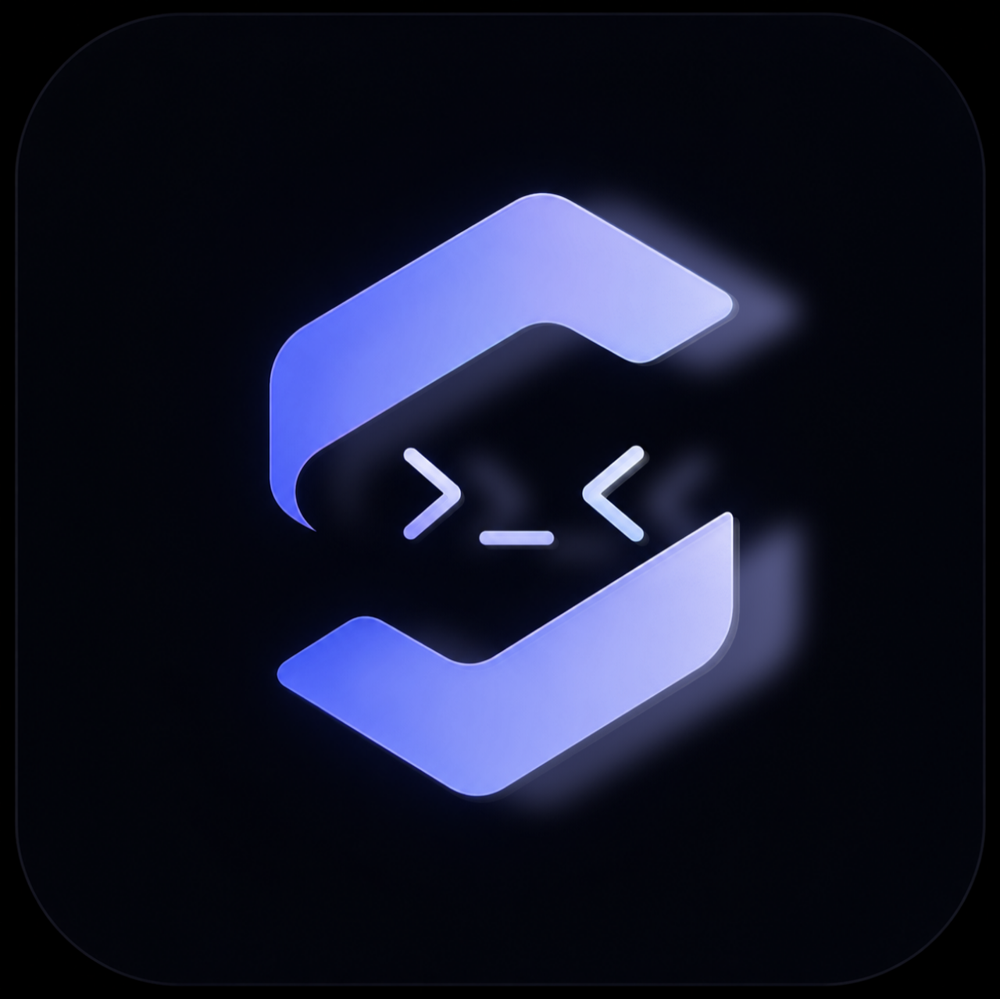

# Syntac

<p align="center">
  
</p>

<p align="center">
  <a href="https://github.com/DraxonV1/Syntac/releases"></a>
  <a href="https://github.com/DraxonV1/Syntac/releases"></a>
  <a href="https://github.com/DraxonV1/Syntac/issues"></a>
  <a href="https://flutter.dev"></a>
  <a href="https://archlinux.org"></a>
</p>

Syntac is a local-first Android coding agent by **DraxonV1**.

Open a project folder on your phone, connect an AI provider, chat about code, inspect file changes, run commands, and keep project state on-device.

**In development right now, expect issues & bugs. Report issues at [/issues](https://github.com/DraxonV1/Syntac/issues).**

- Developer: **DraxonV1**
- Repository: <https://github.com/DraxonV1/Syntac>
- Android package: `com.syntac`
- Current version: `0.1.1-beta.2` (`versionCode` 12)
- Default update channel: **beta**

## Overview

Syntac is built for code work away from a laptop. It gives one Android app enough local context to review a project, ask an AI model for changes, inspect generated edits, and run command-line checks through an Android runtime.

Core behavior:

- Project folders stay on your device.
- Chat history and tool results stay on your device.
- API keys and OAuth credentials stay in Android secure storage.
- Model requests go only to the provider you configure.
- Shell commands run only for the active project.

## Main features

- Local project browser with recent projects and search.
- Chat-based coding agent with streaming responses.
- File tools for reading, writing, editing, listing, deleting, and searching project files.
- Bash tool support through a packaged Android runtime or Termux bridge.
- Provider support for Google Antigravity / Cloud Code Assist, ChatGPT Codex OAuth, Grok, and OpenAI-compatible APIs.
- Markdown/code rendering and expandable tool result cards.
- Startup, runtime, provider, and storage diagnostics.
- Built-in update check with stable, beta, and nightly channels.

## Android runtime

Syntac can run shell commands through:

1. Packaged Arch Linux PRoot runtime installed into app-private storage.
2. Termux `RUN_COMMAND` bridge, if Termux is installed and configured.

Termux setup:

```sh
mkdir -p ~/.termux
printf 'allow-external-apps=true\n' >> ~/.termux/termux.properties
termux-reload-settings
termux-setup-storage
```

Then grant Syntac the Termux command permission from Android settings.

## Updates

Syntac checks update manifests for the active channel. Current default channel is **beta**.

Channels:

- `stable`: tested public releases.
- `beta`: current default channel.
- `nightly`: early testing builds.

Current beta APK target:

```text
https://github.com/DraxonV1/Syntac/releases/download/v0.1.1-beta.2/syntac-arm64.apk
```

Current manifest files:

```text
update/stable.json
update/beta.json
update/nightly.json
```

GitHub fallback manifest URL:

```text
https://raw.githubusercontent.com/DraxonV1/Syntac/main/update/<channel>.json
```

## Build from source

Requirements:

- Flutter stable with Dart compatible with `sdk: ^3.11.5`.
- JDK 17.
- Android SDK.
- Android NDK from Flutter/Android tooling.
- Git LFS.

Clone:

```sh
git clone https://github.com/DraxonV1/Syntac.git
cd Syntac
git lfs pull
```

Install dependencies:

```sh
flutter pub get
```

Run checks:

```sh
dart format lib test
flutter analyze
flutter test
```

Build debug/development APK:

```sh
flutter build apk --release
```

Release APK output:

```text
build/app/outputs/flutter-apk/app-release.apk
```

## Releases

`com.syntac` is public Android package identity. Keep it stable so updates install over existing beta builds.

Contribution flow:

- Open PR with source changes.
- CI runs formatting, analysis, and tests.
- After merge to `master`, GitHub Actions builds signed `syntac-arm64.apk`.
- Release workflow publishes APK and update manifests to GitHub Releases.
- Version tags like `v0.1.1-beta.2` also build APKs and publish releases.
- GitHub Release notes come from `CHANGELOG.md`.

Latest beta release:

<https://github.com/DraxonV1/Syntac/releases/tag/v0.1.1-beta.2>

PR builds never receive release signing credentials or provider OAuth secrets.

Release artifacts:

```text
https://github.com/DraxonV1/Syntac/releases/download/v0.1.1-beta.2/syntac-arm64.apk
update/stable.json
update/beta.json
update/nightly.json
```

## Reference and attribution

Thanks to [oh-my-pi](https://github.com/can1357/oh-my-pi) for giving much reference code. The pinned checkout lives at `reference/omp`.

Runtime source repositories live under `reference/`:

- `reference/omp`: oh-my-pi
- `reference/proot`: proot
- `reference/termux`: Termux proot fork

Provider and model icons use the official [Lobe Icons](https://github.com/lobehub/lobe-icons) unpkg CDN:
`https://unpkg.com/@lobehub/icons-static-svg@latest/icons/{slug}.svg`.
Provider and model metadata comes from the bundled [Models.dev](https://models.dev) snapshot.

## License
